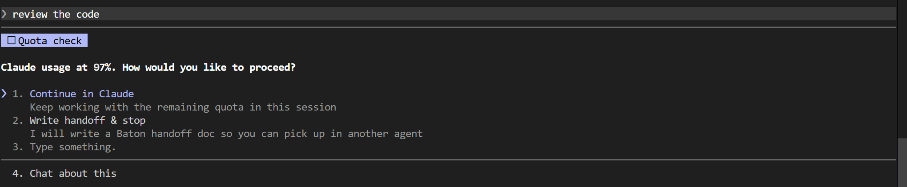

# agent-baton

Don't lose your work when an AI coding agent hits its usage limit.

`baton` monitors usage for Claude Code and Codex, warns you before the threshold, and registers a rich Markdown handoff written by the active agent, with Baton metadata and git evidence appended so the next agent picks up exactly where you left off.

[](https://www.npmjs.com/package/@codeprakhar25/agent-baton)
[](LICENSE)
[](package.json)

---



When Claude crosses the threshold, Baton injects an interactive `AskUserQuestion` prompt — you choose between continuing on remaining quota or writing a handoff so you can pick up in another agent.

---

## The problem

You are deep in a task — three files modified, a bug half-fixed. Claude or Codex hits its hourly usage limit. You either:

- Lose track of what was in progress and start explaining from scratch in another agent.
- Manually copy-paste diffs and notes into a new session.

Baton fixes that. It intercepts at the threshold, gives you a choice, and writes a structured handoff that the next agent can read cold.

---

## Install

```bash
npm install -g @codeprakhar25/agent-baton
```

**Requirements:** Node.js 18+

---

## Quick Start

```bash
# 1. Initialize once per project
cd ~/your-project
baton init

# 2. Work normally — baton hooks into Claude automatically
#    For Codex, use the baton wrapper instead of running codex directly
baton codex "continue the auth refactor"

# 3. When baton warns you, choose: continue or hand off
#    If you choose handoff, pick up in the next agent
baton pickup --to codex
```

That's it. Every handoff is written to `~/.local/state/agent-baton/projects/<slug>/handoffs/` and never touches your repo.

---

## How It Works

Baton has two integration paths:

**Claude Code** — `baton init` installs global hooks into `~/.claude/settings.json` so every Claude session in every project is covered. On `SessionStart`, `UserPromptSubmit`, and `PreToolUse`, `baton guard` reads cached usage with a three-tier TTL (15 min below 50%, 5 min from 50% to the warning band, no cache TTL in the warning band). `SessionStart` and `UserPromptSubmit` always refresh Claude usage before the next model response. When you cross the warning band or the hard threshold, Claude is instructed to fire an interactive `AskUserQuestion` prompt to continue or write a handoff. Soft warnings respect a re-notify cooldown, but the hard threshold is rechecked on every user prompt. `PreToolUse` keeps a separate fetch throttle so tool-heavy turns do not spam the usage API.

**Codex** — `baton codex` wraps the `codex` binary. Usage is checked before Codex launches. If you're over the threshold, Baton asks whether to continue, launch Codex to write a handoff, or run `baton pickup`. Continuing injects a first prompt that tells Codex to ask before doing more work.

```
baton guard / baton codex
          │
          ▼
    fetch usage (cached)
          │
     over threshold?
     ┌────┴────┐
    no         yes
     │          │
  allow     ask user
  work       │      │
          continue  handoff
                     │
              agent writes Markdown
              + Baton appends evidence
                     │
              write HANDOFF-latest.md
                     │
              baton pickup --to <agent>
```

### Handoff format

Each handoff is a Markdown file with:

- Agent-authored task summary, progress, decisions, remaining work, and next step
- Baton metadata and source handoff path
- Git branch, status, diff stat, and last commits
- Full uncommitted diff appended as evidence (truncated at `handoff_extraction.max_diff_chars`)
- Instructions for the next agent

Git state is the durable source of truth — if transcript extraction is incomplete, the diff tells the full story.

```
~/.local/state/agent-baton/projects/<project-slug>-<hash>/
  handoffs/
    HANDOFF-latest.md      ← always points to the most recent
    HANDOFF-<timestamp>.md ← timestamped copy
  usage-cache.json
  pending-transfer.json
```

---

## Supported Agents

| Agent | Integration | Detection method |
|-------|-------------|-----------------|
| **Claude Code** | `SessionStart`, `UserPromptSubmit`, `PreToolUse` hooks | OAuth token → Claude usage API |
| **Codex** | `baton codex` wrapper | `~/.codex/sessions/**/rollout-*.jsonl` `token_count.rate_limits` events |
| **Cursor** | Watch / transcript fallback | Hard-limit error text in transcripts |
| **Gemini CLI** | Watch / transcript fallback | Hard-limit error text in transcripts |

Claude and Codex have proactive detection — Baton knows you're near the limit before it's actually hit. Cursor and Gemini rely on the hard-limit text appearing in transcripts.

---

## Commands

| Command | Description |
|---------|-------------|
| `baton init` | Install global config/state and Claude hooks for the current project |
| `baton usage --from <agent>` | Print current usage-limit status |
| `baton guard --from claude --hook` | Claude hook driver (called automatically) |
| `baton codex [-- <args>] [prompt]` | Launch Codex with usage preflight |
| `baton handoff --from <agent>` | Manually write a handoff from the current transcript and git state |
| `baton handoff --from <agent> --file <path>` | Register a complete Markdown handoff written by the handing-off agent |
| `baton pickup [--to <agent>]` | Launch an agent with a prompt pointing to the latest handoff |

```bash
# Check usage
baton usage --from claude
baton usage --from claude --json       # machine-readable
baton usage --from claude --refresh    # skip cache

# Codex wrapper
baton codex                            # bare launch with preflight
baton codex "finish the login flow"    # with initial prompt
baton codex -- --model o4-mini        # pass codex flags

# Handoff
baton handoff --from codex
baton handoff --from claude --reason rate-limit
baton handoff --from claude --reason rate-limit --file /tmp/baton-handoff.md
baton handoff --from claude --launch   # write + immediately run pickup

# Pickup
baton pickup                           # choose agent interactively
baton pickup --to claude
baton pickup --to codex
```

---

## Configuration

Global config lives at:

```
~/.config/agent-baton/config.json
```

Per-project overrides (never committed):

```
.baton/config.json
```

`baton init` adds `.baton/` to `.gitignore` automatically.

```json
{
  "agents": {
    "cursor":  { "enabled": true, "priority": 1 },
    "claude":  { "enabled": true, "priority": 2 },
    "codex":   { "enabled": true, "priority": 3 },
    "gemini":  { "enabled": true, "priority": 4 }
  },
  "limits": {
    "mode": "ask",
    "handoff_percent": 95,
    "warning_buffer_percent": 5,
    "auto_handoff_on_hard_limit": true,
    "windows": {
      "claude": {
        "five_hour": { "enabled": true, "handoff_percent": 95 },
        "weekly": { "enabled": true, "handoff_percent": 98 },
        "extra": { "enabled": true, "handoff_percent": 95 }
      },
      "codex": {
        "five_hour": { "enabled": true, "handoff_percent": 95 },
        "weekly": { "enabled": true, "handoff_percent": 95 },
        "unknown": { "enabled": true, "handoff_percent": 95 }
      }
    }
  },
  "usage_cache": {
    "safe_ttl_ms": 900000,
    "approach_percent": 50,
    "approach_ttl_ms": 300000,
    "near_limit_ttl_ms": 0,
    "near_limit_percent": 75,
    "pretool_ttl_ms": 60000,
    "notify_cooldown_ms": 900000
  },
  "usage_sources": {
    "claude": {
      "oauth_credentials_path": "~/.claude/.credentials.json"
    }
  },
  "handoff_dir": "handoffs",
  "handoff_extraction": {
    "max_transcript_lines": 100,
    "include_git_diff": true,
    "max_diff_chars": 8000,
    "scan_secrets": true
  }
}
```

**Key options:**

| Key | Default | Description |
|-----|---------|-------------|
| `limits.mode` | `"ask"` | `ask` — prompt before acting; `auto_handoff` — write immediately; `warn_only` — log only |
| `limits.handoff_percent` | `95` | Hard threshold; Baton blocks and asks at this level |
| `limits.warning_buffer_percent` | `5` | Warning band starts this many points below `handoff_percent` (default warns at 90%) |
| `limits.windows.<agent>.<window>` | see config | Per-agent, per-window threshold policy |
| `limits.auto_handoff_on_hard_limit` | `true` | Auto-write a handoff when hard-limit text appears |
| `usage_cache.safe_ttl_ms` | `900000` | Cache TTL below `approach_percent` (15 min) |
| `usage_cache.approach_percent` | `50` | Usage percentage where the 5-minute approach TTL starts |
| `usage_cache.approach_ttl_ms` | `300000` | Cache TTL from `approach_percent` up to the warning band (5 min) |
| `usage_cache.near_limit_ttl_ms` | `0` | Cache TTL inside the warning band; `0` means recheck at hook boundaries |
| `usage_cache.pretool_ttl_ms` | `60000` | Minimum interval between fresh API fetches triggered by `PreToolUse` |
| `usage_cache.notify_cooldown_ms` | `900000` | Cooldown before re-notifying after the user chose continue |
| `handoff_extraction.max_diff_chars` | `8000` | Per-file diff truncation cap |

Environment overrides: `AGENT_BATON_CONFIG_HOME`, `AGENT_BATON_STATE_HOME`, `XDG_CONFIG_HOME`, `XDG_STATE_HOME`.

---

## Troubleshooting

**No Codex usage found**
Start or continue a Codex session so it emits `token_count.rate_limits` events into its rollout JSONL. Baton reads from `~/.codex/sessions/**/rollout-*.jsonl`.

**Claude usage unavailable**
Ensure Claude Code is OAuth-authenticated and `~/.claude/.credentials.json` exists. Run `baton usage --from claude --refresh` to force a fetch.

**Pickup says agent missing**
The target CLI is not on `PATH`. Install it or check your shell config.

**Hooks not firing**
Re-run `baton init` in the project directory. Check that `~/.claude/settings.json` (global) contains the Baton guard hooks under `hooks`. Codex hooks live in `~/.codex/hooks.json`.

---

## Current Limits

- Context-window fullness is not monitored. Baton only handles usage-limit signals.
- Cursor and Gemini CLI have partial support — proactive detection requires hard-limit text to appear in transcripts.
- There is no automatic agent exit. Baton warns and writes the handoff; you exit the current agent and run `baton pickup` manually.

---

## License

MIT
